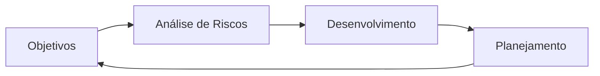

# Projeto Chaos-IT

## Parte 1 – Modelo Espiral

O Modelo Espiral seria a melhor escolha para o projeto dos drones subaquáticos porque ele possui uma etapa de análise de riscos em cada ciclo do desenvolvimento. Como o projeto envolve tecnologias complexas e um ambiente difícil de prever, identificar riscos antecipadamente poderia evitar falhas e prejuízos.

### Como a análise de riscos evitaria a queda dos drones?

Durante cada volta da espiral, a equipe poderia analisar problemas como:

* Falha nos sensores;
* Perda de comunicação;
* Erros da IA de navegação;
* Baixa duração da bateria.

Assim, esses problemas seriam testados e corrigidos antes da implantação dos drones em situações reais.

### Ciclo da Espiral para o projeto

**Objetivos:** definir requisitos e funcionalidades dos drones.

**Análise de Riscos:** identificar possíveis falhas e criar protótipos para testes.

**Desenvolvimento:** implementar as funcionalidades planejadas e realizar testes.

**Planejamento:** avaliar resultados e definir a próxima etapa do projeto.

---

## Parte 2 – Diagnóstico CMMI

A Chaos-IT se encontra no **Nível 1 (Inicial)** do CMMI.

Isso porque não possui processos definidos, documentação, histórico de erros ou planejamento adequado. O sucesso dos projetos depende muito do esforço individual dos desenvolvedores.

### O que falta para chegar ao Nível 2?

Para atingir o **Nível 2 (Gerenciado)**, a empresa precisa:

* Documentar requisitos;
* Planejar melhor os projetos;
* Registrar erros e soluções;
* Utilizar controle de versão;
* Acompanhar o andamento das atividades.

Com essas melhorias, os projetos se tornam mais organizados e previsíveis.
