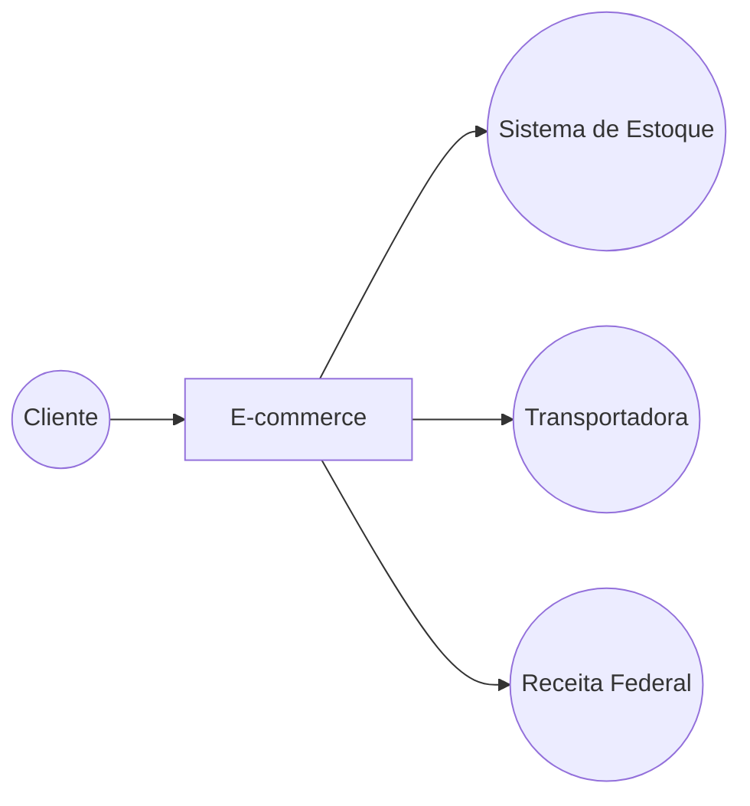
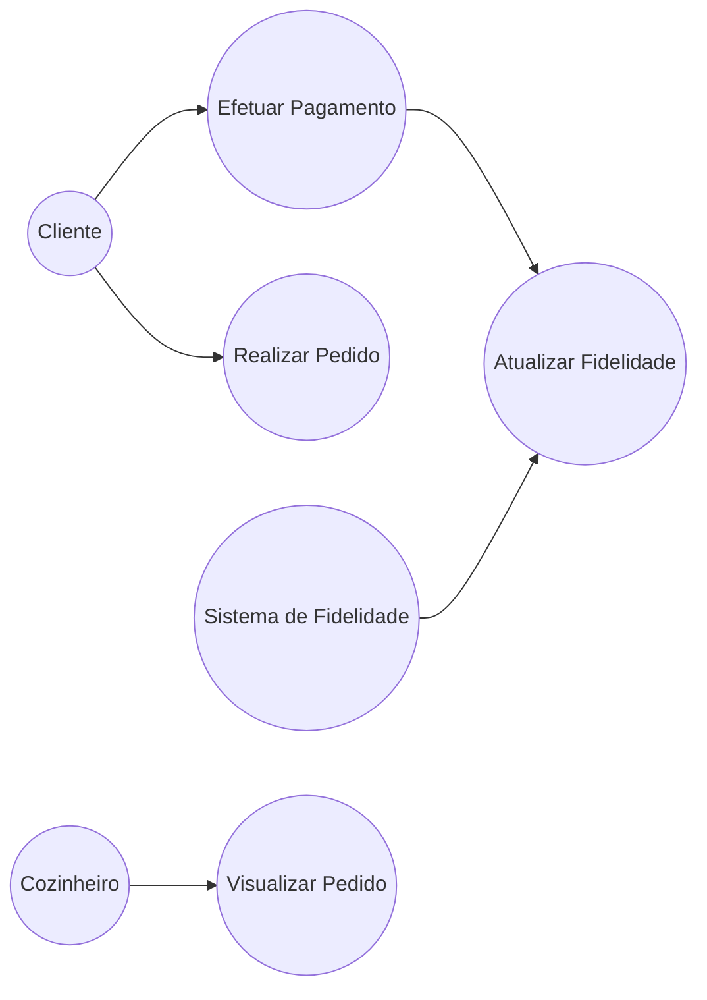
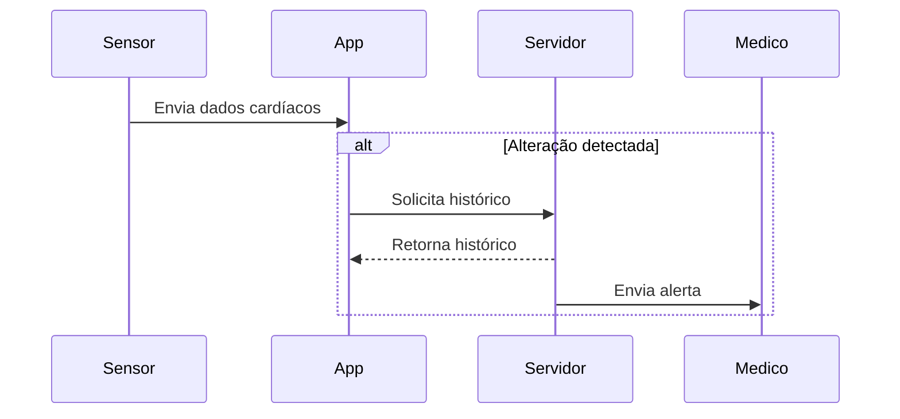
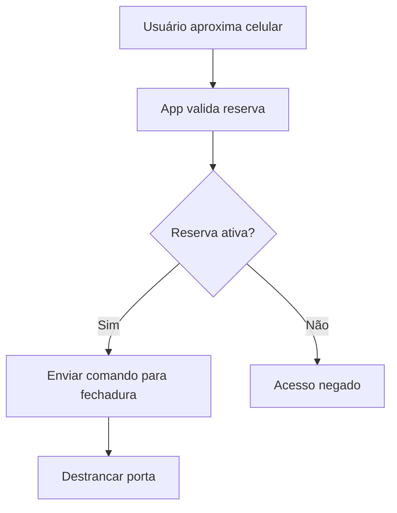
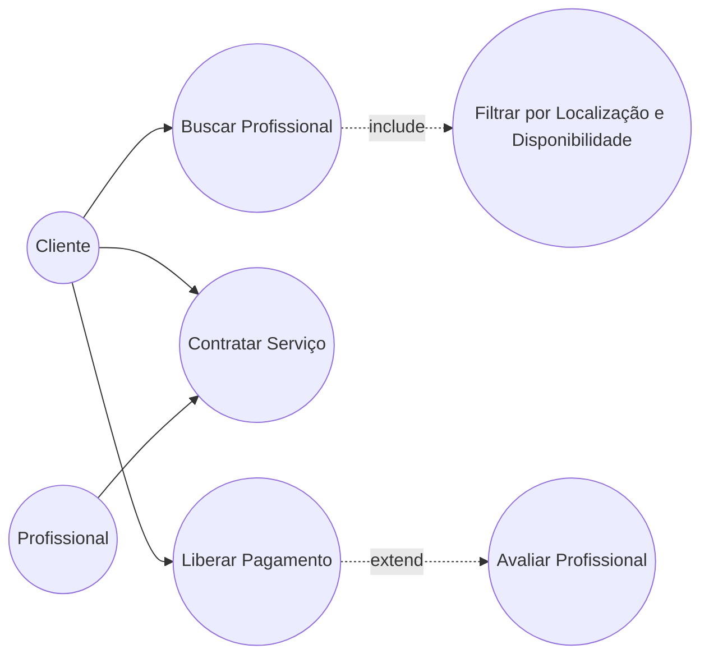

# Exercícios de Diagramas UML

## Cenário 1 – Logística de E-commerce Global

### Diagrama de Casos de Uso

---

## Cenário 2 – Totem de Autoatendimento em Fast-Food

### Diagrama de Casos de Uso

---

## Cenário 3 – Sistema de Telemedicina

### Diagrama de Sequência

---

## Cenário 4 – Sistema de Controle de Acesso Inteligente

### Diagrama de Atividades

---

## Cenário 5 – Marketplace de Serviços Domésticos

### Diagrama de Casos de Uso

